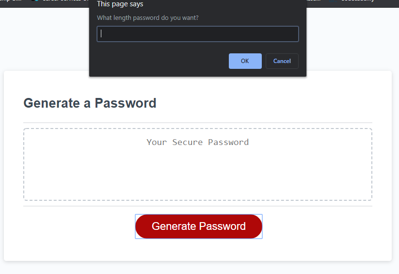
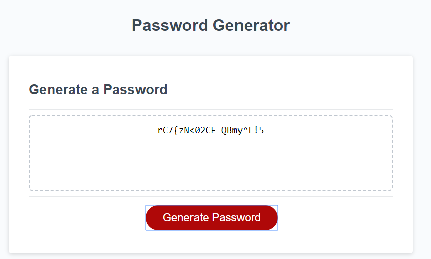

# Password Generator

Password Generator is an application that generates a random password based on user-selected criteria. This app runs in the browser and is responsive to different screen sizes.

The app asks the user the length of the password they want create and which type of characters to include, then generates a password based on the user selected criteria.  The password length must be between 8 and 128 characters and the user must select at least one character type to include.  The character types available are lowercase letters, uppercase letters, numbers, and special characters.

## Links

* Deployed App: https://ryan-harris.github.io/password-generator/
* Github Repo: https://github.com/ryan-harris/password-generator

## Screenshots

